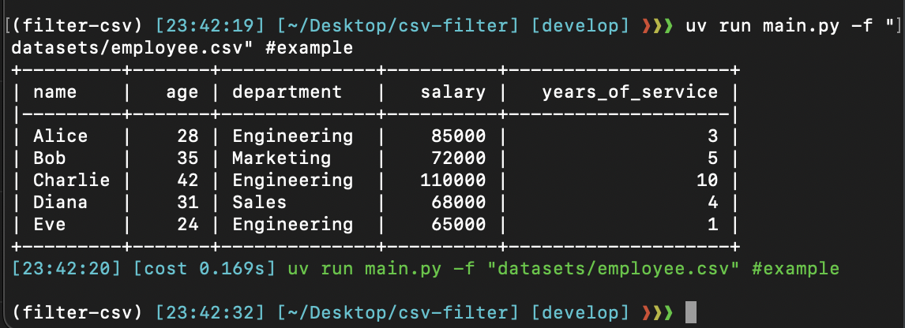

### For this project you need `uv` package manager
install [here](https://docs.astral.sh/uv/getting-started/installation/)


get dependencies
```bash
uv sync
source .venv/bin/activate
```

run script
```bash
uv run main.py -f "datasets/employee.csv" #example
```



tests
```bash
pytest --cov=utils tests/ #80% with main.py
```
